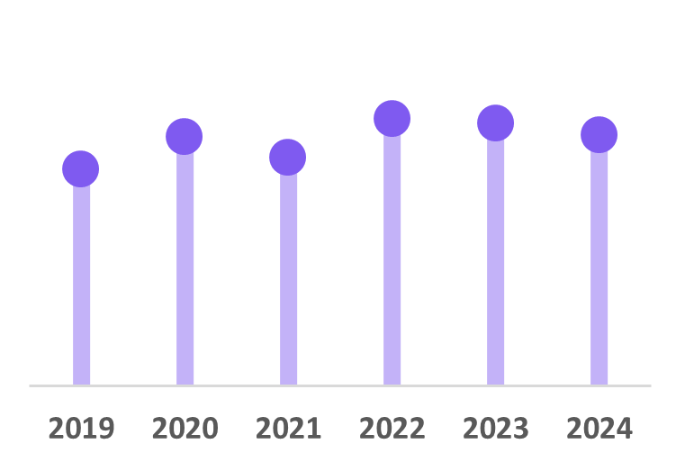
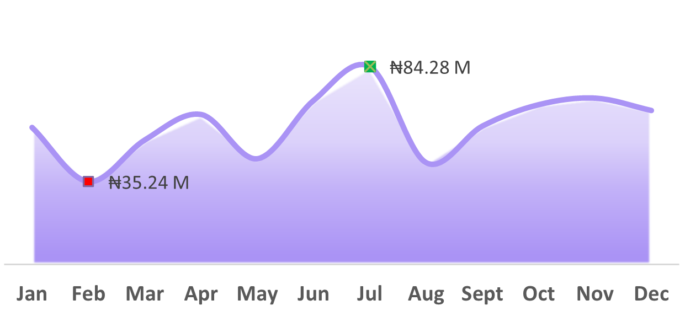
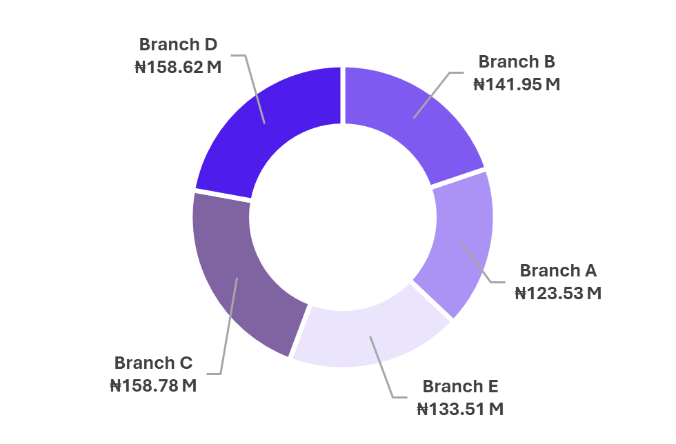
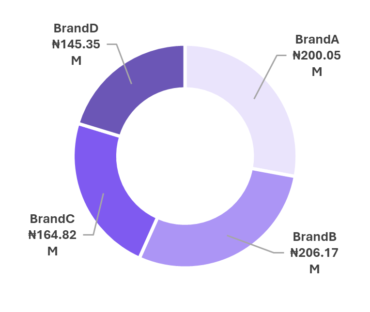
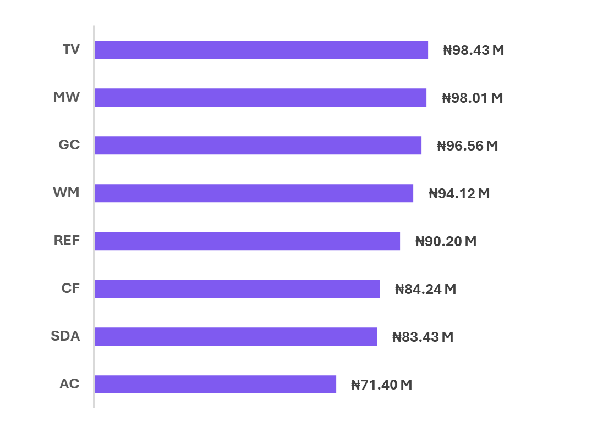

# RoyaltyMart Home Appliances: 5-Year Business Intelligence Analysis

> A comprehensive data-driven analysis of 5-year sales performance across multiple business dimensions, delivering actionable insights for strategic decision-making.

## 📊 Project Overview

This project analyzes RoyaltyMart Home Appliances' business performance from 2019-2024, covering *₦716.38M in sales* across 5 branches, 8 product categories, and 6 sales team members. The analysis identifies critical performance gaps and provides strategic recommendations projected to increase revenue by *15-20%*.

### 🎯 Key Objectives
- Analyze multi-dimensional sales performance over 5 years
- Identify growth opportunities and operational inefficiencies  
- Provide data-driven recommendations for strategic decision-making
- Develop performance optimization strategies

## 🔍 Business Context

*Company*: RoyaltyMart Home Appliances  
*Industry*: Retail - Home Appliances  
*Market*: Nigeria  
*Business Model*: Multi-branch premium to mid-range retailer

### 📈 Key Metrics
- *Total Revenue*: ₦716.38M
- *Units Sold*: 2,771
- *Average Unit Price*: ₦257.32K
- *Total Transactions*: 550
- *Analysis Period*: 2019-2024

## 🛠 Tech Stack & Tools

- *Data Analysis*: Python, Pandas, NumPy
- *Visualization*: Matplotlib, Seaborn, Plotly
- *Business Intelligence*: Power BI, Excel
- *Statistical Analysis*: SciPy, Statsmodels
- *Reporting*: Jupyter Notebooks

## 📁 Project Structure

royaltymart-analysis/
│
├── data/
│   ├── data.xlsx
│
├── Project Brief/
│   ├── Project Brief.docx

├── reports/
│   ├── RoyaltyMart Analysis PPT.pdf
│   └── RoyaltyMart Analysis PPT.pptx
│
└── README.md

## 🚀 Key Findings

### 📊 Sales Performance
- *Consistent Growth*: Steady YoY improvement from ₦105.13M (2019) to ₦129.73M (2024)
- *Seasonal Patterns*: Q4 consistently outperforms (₦204.53M vs Q1 ₦146.57M)
- *Revenue Stability*: Minimal quarterly variation indicating business stability

### 🏆 Top Performing Categories
| Category | Revenue | Units | Avg Price | Contribution |
|----------|---------|-------|-----------|--------------|
| TV | ₦98.43M | 360 | ₦268.80K | 13.74% |
| Microwave | ₦98.01M | 371 | ₦265.14K | 13.69% |
| Gas Cooker | ₦96.56M | 363 | ₦254.25K | 13.48% |
| Washing Machine | ₦94.12M | 409 | ₦242.27K | 13.14% |

### 🏢 Branch Performance
| Branch | Revenue | Units | Avg Price | Contribution |
|--------|---------|-------|-----------|-------------|
| Branch C | ₦158.78M | 613 | ₦253.62K | 22.16% |
| Branch D | ₦158.62M | 612 | ₦259.30K | 22.14% |
| Branch B | ₦141.95M | 547 | ₦268.04K | 19.81% |
| Branch E | ₦133.51M | 506 | ₦260.57K | 18.64% |
| Branch A | ₦123.53M | 493 | ₦244.32K | 17.24% |

### 👥 Sales Team Performance
- *Performance Gap*: 45% difference between top and bottom performers
- *Top Performer*: Samuel (₦134.98M, 511 units)
- *Bottom Performer*: Alex (₦89.57M, 342 units)
- *Opportunity*: Significant potential for performance improvement

## 🎯 Strategic Recommendations

### ⚡ Immediate Actions (90 Days)

#### 1. Sales Team Development
python
# Performance improvement strategy
recommendations = {
    'mentorship_program': 'Samuel leads knowledge transfer',
    'training_focus': 'Bottom 2 performers (Jane & Alex)',
    'incentive_structure': 'Performance-based compensation'
}

#### 2. Inventory Optimization
- *Increase stock*: TV, MW, GC, WM categories
- *Promotional campaigns*: AC, SDA, CF categories
- *Demand forecasting*: Prevent stockouts in high-performing categories

#### 3. Branch Strategy
- *Replicate success*: Branch C strategies across locations
- *Pricing optimization*: Branch B revenue per unit analysis
- *Performance metrics*: Branch-specific KPIs

### 📈 Long-term Strategy (6-12 Months)

#### Category Expansion
- Focus investment on TV and premium segments
- Explore premium pricing in REF segment
- Optimize category mix based on profitability

#### Performance Management
- Advanced analytics for real-time tracking
- Quarterly performance reviews with coaching
- Succession planning for key positions

## 📊 Expected Business Impact

### 💰 Quantitative Projections
- *Revenue Growth*: 15-20% increase
- *Inventory Turnover*: 25% improvement
- *Performance Gap*: Reduce from 45% to 20%
- *Cost Reduction*: 10-15% operational savings

### 🎯 Qualitative Benefits
- Enhanced customer satisfaction
- Improved team performance consistency
- Stronger market position
- Better inventory management

### Quick Start
bash
# Clone the repository
git clone https://github.com/oladayotimileyin/royaltymart-analysis.git
cd royaltymart-analysis

## 📈 Key Visualizations

### Sales Trend Analysis

### Category Performance

## 🏆 Skills Demonstrated

### Technical Skills
- *Data Analysis*: Multi-dimensional business intelligence
- *Statistical Analysis*: Performance evaluation and forecasting
- *Data Visualization*: Executive dashboards and reporting
- *Business Intelligence*: Strategic insight development

### Business Skills
- *Strategic Thinking*: Gap analysis and opportunity identification
- *Performance Optimization*: Benchmarking and improvement strategies
- *Executive Communication*: Stakeholder reporting and presentation
- *Project Management*: Timeline and deliverable coordination

## 📝 Project Deliverables

- [x] Executive Summary Report
- [x] Interactive Performance Dashboard
- [x] Strategic Recommendations Framework
- [x] Implementation Timeline
- [x] KPI Monitoring System
- [x] Python Analysis Scripts
- [x] Jupyter Notebooks
- [x] Data Visualizations

## 🤝 Contributing

This project is part of my data analytics portfolio. For questions or collaboration opportunities:

- *Email*: tooladayo@gmail.com
- *LinkedIn*: [Oladayo Timileyin](https://linkedin.com/in/oladayotimileyin)
- *Portfolio*: [Oladayo Timileyin Portfolio](otimileyin.netlify.app)

## 📄 License

This project is licensed under the MIT License - see the [LICENSE](LICENSE) file for details.

## 🙏 Acknowledgments

- Data generated for portfolio demonstration purposes
- Inspired by real-world retail analytics challenges
- Built with modern data science best practices

---

⭐ *Star this repository if you found it helpful!*

📧 *Open to remote opportunities in Data Analysis, Business Intelligence, and Strategic Analytics*

---

This project demonstrates advanced analytical capabilities and strategic thinking skills essential for data-driven roles in today's business environment.
